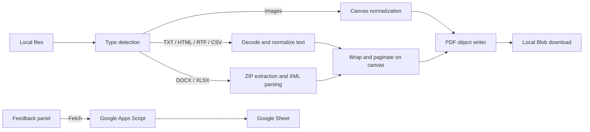

# ConvertToPDFFree

A dependency-free web app that converts images and lightweight document content into a single PDF in the browser, keeping conversion files on the user's device.

## Overview

ConvertToPDFFree provides a focused alternative to file converters that require document uploads. I built the complete conversion path in browser-native JavaScript: file ingestion, image normalization, Office Open XML extraction, text pagination, PDF serialization, and download. The result is a static site that needs no conversion server or runtime package installation.

This is a content-oriented converter, not a layout-faithful document renderer. It extracts DOCX paragraphs and XLSX cell values, strips HTML to text, and treats the remaining text formats as plain text. Original styling is not reproduced, and RTF control syntax is not interpreted.

## Features

- Accepts JPG, JPEG, PNG, WEBP, GIF, BMP, SVG, DOCX, XLSX, TXT, Markdown, CSV, TSV, RTF, and HTML files.
- Combines multiple inputs into one PDF with reorder, remove, and clear controls.
- Provides image previews and file metadata before conversion.
- Supports fit-to-image, A4, and Letter pages; configurable margins; and optional crop-to-fill for images.
- Generates and downloads the PDF locally with a sanitized filename.
- Includes a responsive feedback panel with public/private messages and owner replies.

## Technical Highlights

- **Zero-dependency conversion pipeline:** `app.js` uses browser APIs rather than a PDF or Office library. It writes PDF 1.4 objects, image streams, page trees, cross-reference offsets, and the trailer directly into a downloadable `Blob`.
- **Office parsing without uploads:** DOCX and XLSX files are treated as ZIP containers. The converter locates the ZIP central directory, inflates supported entries with `DecompressionStream`, parses their XML, and extracts paragraphs, shared strings, and worksheet cells.
- **Format normalization:** Browser-readable images are composited onto a white canvas and encoded as JPEG before being embedded. HTML is parsed with `DOMParser`, with script and style content removed before text rendering.
- **Text resilience:** BOM detection and multiple fallback encodings improve non-UTF-8 input handling. Text pages are wrapped, paginated, rendered at 2x canvas resolution, and support right-to-left drawing direction.
- **Explicit rendering tradeoff:** Text pages are embedded as JPEGs. This keeps PDF generation and multilingual browser rendering simple, but the resulting text is not selectable and image encoding can increase output size.
- **Privacy boundary:** Selected conversion files are read and processed only by `app.js`; they are not sent to the feedback backend. The site itself is not network-isolated: it loads Google Analytics, and feedback submissions are sent to a deployed Google Apps Script endpoint backed by Google Sheets.
- **Defensive feedback flow:** The optional backend validates app IDs, field lengths, email shape, and a honeypot; it excludes email and private message content from public GET responses. Frontend output is inserted with `textContent` rather than raw HTML.
- **Accessible interaction:** Status changes use live regions, queue actions have labels, keyboard users can close the feedback dialog with Escape, and responsive CSS adapts the workspace and controls for narrow screens.

No automated tests or CI configuration are currently included. Verification is manual in a modern browser, with particular attention to each input parser, page sizing, file ordering, and downloaded PDF validity.

## Architecture



The conversion path and feedback path are separate. File bytes flow only through the browser-side conversion path; the feedback integration sends form data, not selected conversion files.

## Tech Stack

- HTML5 with ARIA labels and live status regions
- CSS3 with responsive media queries
- Vanilla JavaScript
- Browser APIs: FileReader, Canvas, Blob, DOMParser, TextDecoder, DecompressionStream, and Web Crypto
- PDF 1.4 serialization implemented in the repository
- Google Apps Script and Google Sheets for feedback
- Google Analytics for site analytics
- Static custom-domain configuration via `CNAME`

## Getting Started

No build step or dependency installation is required.

1. Clone or download the repository.
2. Open `index.html` directly in a modern browser, or serve the directory with the documented static-server command:

   ```bash
   python3 -m http.server 4173
   ```

3. If using the server, visit `http://localhost:4173`.
4. Add supported files, arrange their order, choose page settings, and select **Make PDF**.

`DecompressionStream` support is required to unpack compressed DOCX and XLSX files. The conversion UI works without backend setup; feedback uses the endpoint already configured in `feedback.js`. Deploying a replacement feedback backend requires a Google Sheet and the setup steps in `google-apps-script/feedback-backend.gs`.

## Demo

Live site: [converttopdffree.com](https://converttopdffree.com/)

## Project Status

**Active.** The converter, static deployment configuration, analytics, and feedback integration are implemented. Automated regression tests are the clearest future improvement.

## What I Learned

- A useful PDF can be assembled from first principles by tracking indirect objects and byte-accurate cross-reference offsets; a full PDF library is not mandatory for a constrained exporter.
- DOCX and XLSX share a ZIP/XML foundation, but extracting useful content still requires format-specific handling for paragraphs, shared strings, inline strings, and worksheet ordering.
- Browser-native APIs make local-first document processing practical, while also imposing compatibility and fidelity limits that should be visible in the product contract.
- Privacy claims need narrow wording: local conversion can coexist with analytics and feedback integrations, so file handling and general network activity must be described separately.
